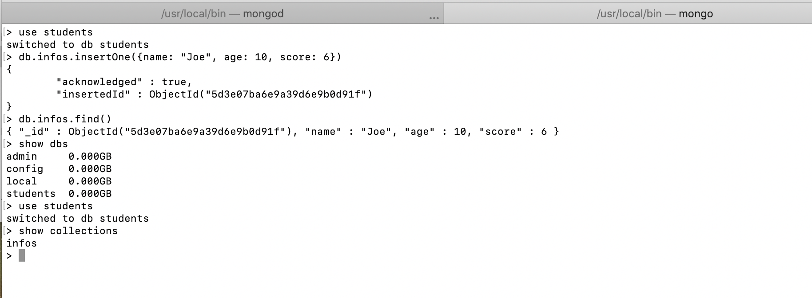
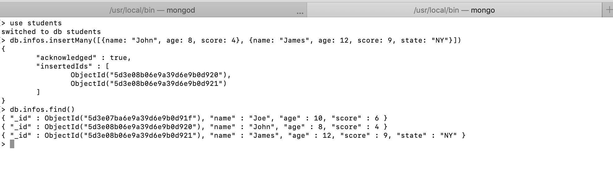
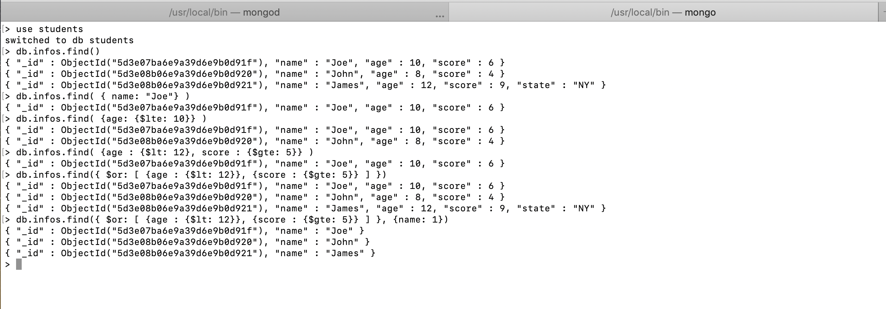
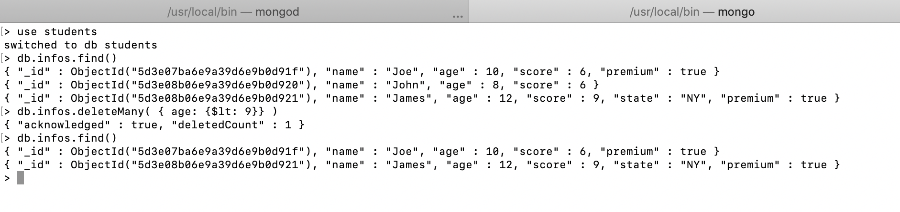

### `This file is an introduction about some basic commands in Mongo Shell.`

### Open up the Mongo Shell

```bash
$ mongo
```

### `1. Create a database and a collection and add an document(item).`

```bash
$ use students
$ db.infos.insertOne({name: "Joe", age: 10, score: 6})
```

- Test it.

```bash
$ db.infos.find()
```

- Show all existed database

```bash
$ show dbs
```

- Switch to a database

```bash
$ use students
```

- Show all collections

```bash
$ show collections
```

- Should look like this so far<br>



- Delete a collection.

```bash
$ use students
$ db.infos.drop()
```

- Quit the Mongo Shell

```bash
$ quit()
```

`note:`

- JSON doesn't recognize single quote('') for a string value.
- Clear the terminal: `ctrl + k`

### `2. Insert multiple documents.`

```bash
$ use students
$ db.infos.insertMany([{name: "John", age: 8, score: 4}, {name: "James", age: 12, score: 9, state: "NY"}])
```

- Test it.

```bash
$ db.infos.find()
```

- Should look like this so far<br>



### `3. Querying documents.`

- Querying all documents in a collection.

```bash
$ use students
$ db.infos.find()
```

- Querying documents by key pairs.

```bash
$ db.infos.find( { name: "Joe" } )
```

- Querying documents by one condition.

```bash
$ db.infos.find( {age: {$lte: 10}} )
```

- Querying documents by more than one condition (AND query).

```bash
$ db.infos.find( {age : {$lt: 12}, score : {$gte: 5}} )
```

- Querying documents by more than one condition (OR query).

```bash
$ db.infos.find({ $or: [ {age : {$lt: 12}}, {score : {$gte: 5}} ] })
```

- Querying documents by more than one condition (OR query), then select a filed to show up.

```bash
$ db.infos.find({ $or: [ {age : {$lt: 12}}, {score : {$gte: 5}} ] }, {name: 1})
```

- Should look like this so far<br>



### `4. Updating documents.`

- Update the first one matching documents in a collection.

```bash
$ use students
$ db.infos.updateOne( { name: "John"}, { $set: {score: 6}} )
```

- Update many documents in a collection satisfy to a AND query.

```bash
$ use students
$ db.infos.updateMany( {age: {$gt: 9}, score: {$gte: 6}}, { $set: {premium: true}} )
```

- Should look like this so far<br>


### `5. Deleting documents.`

- Delete documents querying by conditions.

```bash
$ use students
$ db.infos.find()
$ db.infos.deleteMany( { age: {$lt: 9}} )
$ db.infos.find()
```

- Should look like this so far<br>



- Delete all documents in a collection.

```bash
$ use students
$ db.infos.deleteMany({})
```
