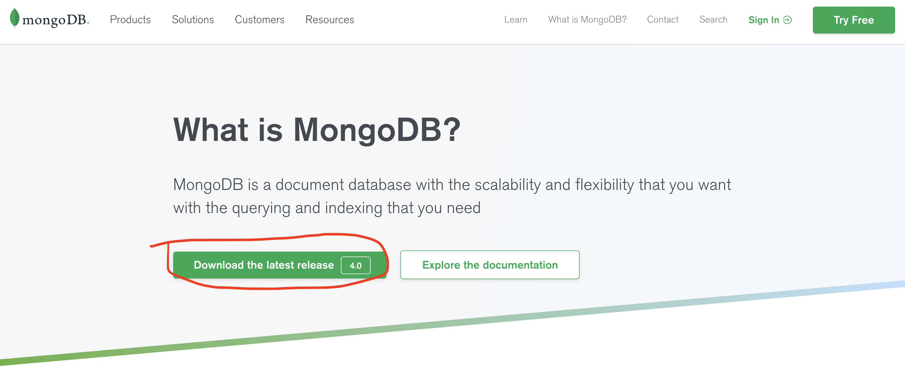
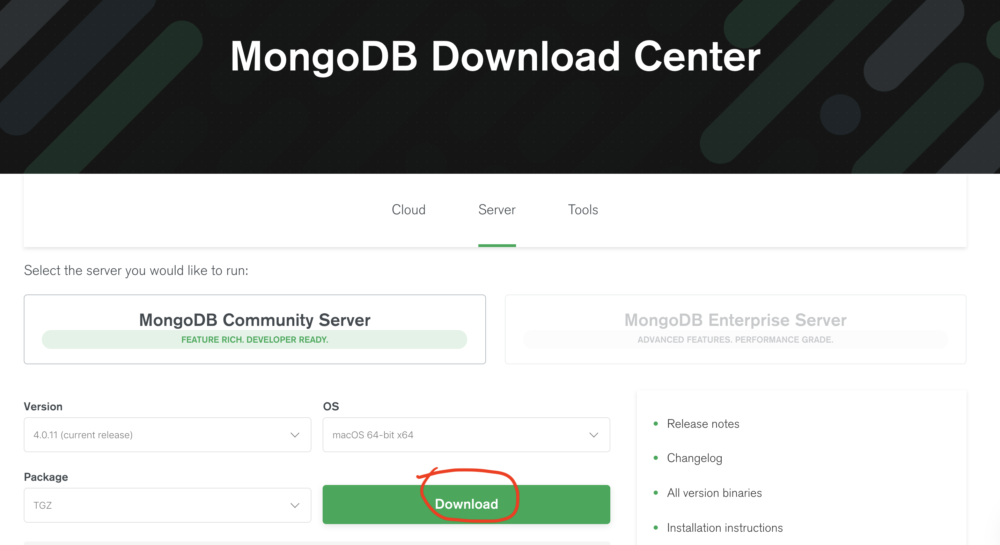
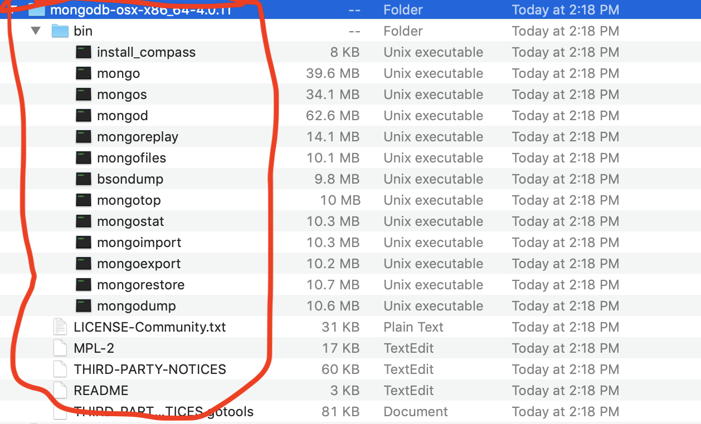
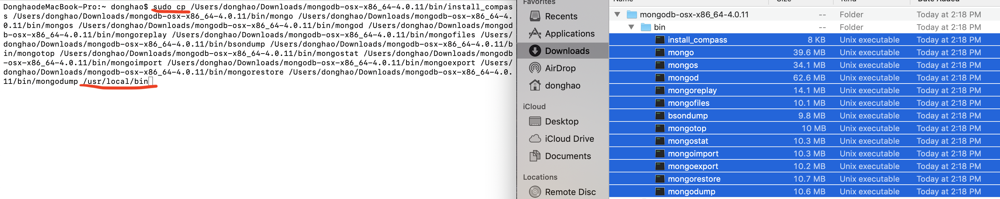
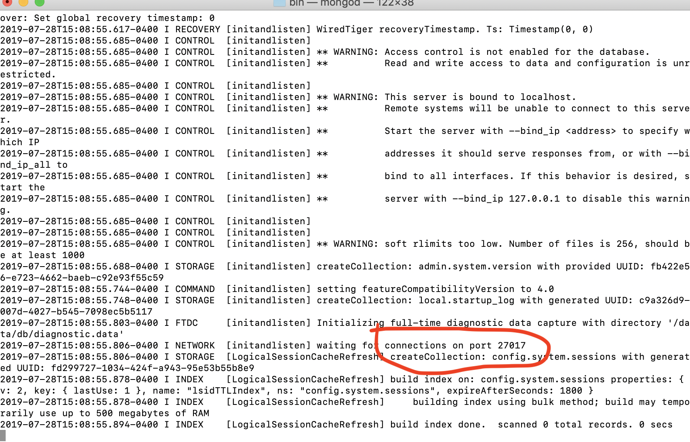
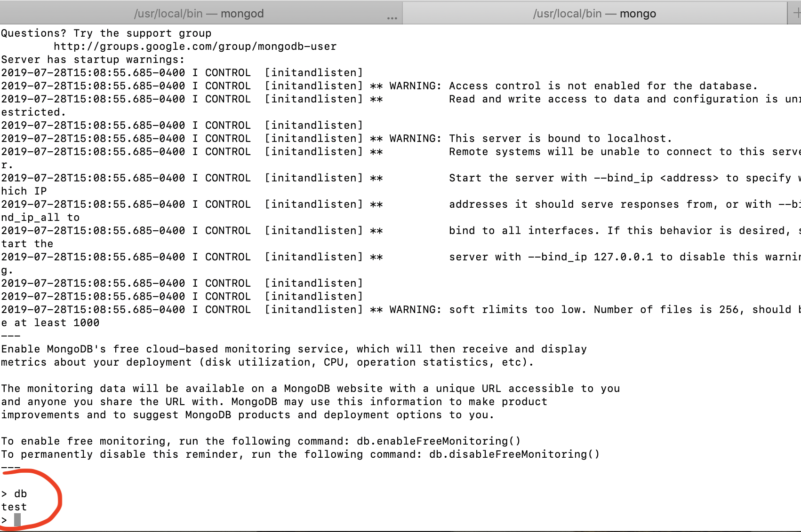

### `This file is an introduction about how to install MongoDB and some basic terminal commands.`

### `Important commands`
- Run the db server
```bash
$ mongod
```
- Stop the db server(In server terminal)
`ctrl + c`

- Connect the db server in Mongo Shell way
```bash
$ mongo
```
- Stop the db server(In shell terminal)
```bash
> use admin
> db.shutdownServer()
```

### How to install MongoDB(on Mac)?

#### `Step1 :open your browser at`<br>https://www.mongodb.com/what-is-mongodb.<br>

<br>


#### `Step2 : Install in local`

- click on the download file, look like this.<br>



- open your terminal, type these commands(you can drag all the files to terminal)

```bash
sudo cp (all the files name in bin folder) /usr/local/bin
```

- Shouldlook like this,



- Check if this command works by this command

```bash
$ cd /usr/local/bin
```

#### `Step3 : Create DB server and run it`

```bash
$ cd /usr/local/bin
$ sudo mkdir -p /data/db
$ sudo chown -R `id -un` /data/db

//Run the database
$ mongod
```

`note:`

- After you run the database, you can find your database port, like this.



#### `Step4 : Connect to the server in Mongo Shell way.(you can also connect it in Compass App in UI way.)`

`Location: open another terminal`

```bash
$ mongo
```

- To check if it is working

```bash
$ db
```

- Get result like this:


